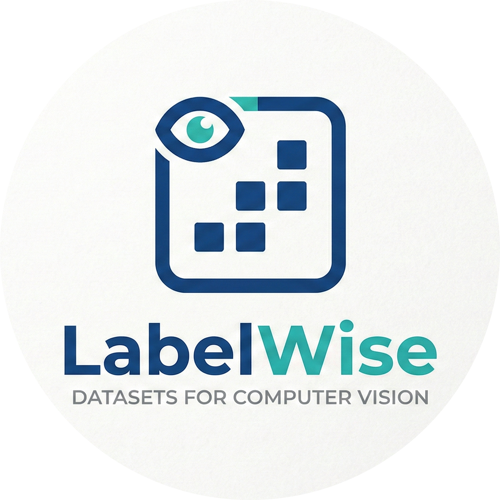

<div align="center">



# labelWise

**Importa · Etiqueta · Exporta**

Herramienta web open-source para anotar imágenes con bounding boxes y exportar/importar anotaciones en CSV — sin backend, sin instalación, todo en el navegador.

[](https://label-wise-ashen.vercel.app/)
[](https://jusolo-labelwise.mintlify.app/introduction)
[](./CHANGELOG.md)
[](./LICENSE)

</div>

---

## ✨ Características

| Función | Descripción |
|---|---|
| 🖼️ **Multi-imagen** | Carga varias imágenes a la vez y navega entre ellas |
| ✏️ **Bounding boxes** | Dibuja, mueve, redimensiona y elimina cuadros sobre el canvas |
| 🏷️ **Etiquetas con color** | Crea etiquetas individuales o por lote; el sistema asigna colores visualmente distintos automáticamente |
| 🎨 **Editor de color** | Cambia el color de cualquier etiqueta con el selector nativo del sistema |
| 📋 **Copiar / Pegar** | Copia anotaciones seleccionadas y pégalas con `Ctrl/Cmd + C/V` |
| 🔲 **Selección múltiple** | Selecciona varios cuadros con `Ctrl/Cmd + clic` |
| 📐 **Guía de cuadrícula** | Overlay de grid para alineación más precisa |
| 🔍 **Zoom + Scroll** | Zoom 50–300% con scrollbars horizontal y vertical en el canvas |
| 📊 **Vista CSV** | Tabla editable en tiempo real con todos los campos de cada anotación |
| ⬆️ **Importar CSV** | Carga anotaciones previas desde CSV mapeando por `image_name` |
| ⬇️ **Exportar CSV** | Descarga el dataset completo en un archivo listo para entrenamiento |
| 💾 **Sesión persistente** | Todo se guarda en IndexedDB — recarga la página sin perder nada |

---

## 🗂️ Formato CSV

Una fila por anotación. Esquema esperado:

```csv
label_name,bbox_x,bbox_y,bbox_width,bbox_height,image_name,image_width,image_height
car,2660,2640,757,241,image_001.png,3613,10821
person,2660,2904,757,217,image_001.png,3613,10821
```

| Campo | Tipo | Descripción |
|---|---|---|
| `label_name` | string | Nombre de la etiqueta |
| `bbox_x` | int | Coordenada X de la esquina superior izquierda |
| `bbox_y` | int | Coordenada Y de la esquina superior izquierda |
| `bbox_width` | int | Ancho del cuadro en píxeles |
| `bbox_height` | int | Alto del cuadro en píxeles |
| `image_name` | string | Nombre del archivo de imagen |
| `image_width` | int | Ancho original de la imagen |
| `image_height` | int | Alto original de la imagen |

---

## 🛠️ Tech Stack

<div align="center">

| | Tecnología |
|---|---|
| ⚛️ | React 19 + TypeScript |
| ⚡ | Vite 7 |
| 🎨 | Tailwind CSS v4 |
| 🧩 | shadcn/ui patterns |
| 🗄️ | IndexedDB (persistencia de sesión) |
| 🔔 | Sileo (toasts) |

</div>

---

## 🚀 Primeros pasos

```bash
# 1. Instalar dependencias
npm install

# 2. Modo desarrollo
npm run dev

# 3. Build de producción
npm run build

# 4. Preview del build
npm run preview
```

La app estará disponible en `http://localhost:5173`.

---

## 📁 Estructura del proyecto

```
src/
├── App.tsx                         # Componente raíz y lógica principal
├── features/
│   └── labelwise/
│       ├── components/
│       │   ├── changelog-modal.tsx # Modal con historial de cambios
│       │   └── lw-select.tsx       # Select personalizado
│       ├── utils/
│       │   ├── color.ts            # Generación de colores distintos
│       │   ├── csv.ts              # Parser de CSV
│       │   └── sessionStore.ts     # Persistencia con IndexedDB
│       ├── constants.ts
│       └── types.ts
└── components/
    └── ui/                         # Componentes base (shadcn/ui)
```

---

## 🗺️ Roadmap

- [ ] Atajos de teclado (panel de ayuda)
- [ ] Historial de deshacer / rehacer
- [ ] Ajuste de cuadros al grid (snapping)
- [ ] Colaboración en equipo y datasets versionados
- [ ] Soporte para anotación de polígonos y puntos clave

---

## 📝 Changelog

Consulta [CHANGELOG.md](./CHANGELOG.md) para ver el historial completo de versiones.

---

## 🤝 Contribuir

Lee [CONTRIBUTING.md](./CONTRIBUTING.md) antes de abrir un PR.

---

<div align="center">

Hecho con ♥ · Licencia [MIT](./LICENSE)

</div>
